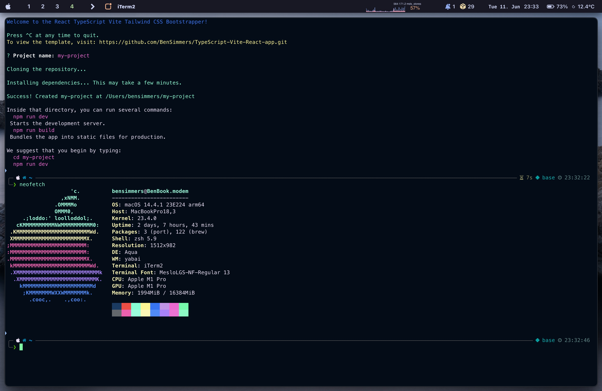

# create-vite-bootstrapper

This is a simple script to create a vite project with the following features:

If you want to create a frontend project with the following features, you can choose from the front end template with the following features:
- TypeScript for type safety and modern JavaScript features
- ESLint for linting
- Prettier for code formatting
- TailwindCSS for styling
- PostCSS for processing CSS
- Zustand for state management
- React Router for routing
- vitest for testing components
- nginx for serving the app
- Docker for containerizing the app
- makefile for running common tasks

If you want to create a backend project with the following features, you can choose from the backend template with the following features:
- TypeScript for type safety and modern JavaScript features
- Bun a new javascript runtime
- docker for containerizing the app
- neonDB for a simple database
- morgan for logging
- express for routing
- helmet for security
- cors for cross-origin requests


## Usage

```bash
npx create-vite-bootstrapper my-project
```

## Notes
This is a companion command for the template repository [TypeScript-Vite-React](https://github.com/BenSimmers/TypeScript-Vite-React-app.git) and the [Bun-api-base](https://github.com/BenSimmers/bun-api-base) which can be used as the boilerplate for the project.

## Contributing
- This is a simple script, but we are using changesets as a way to manage versioning. Please make sure to create a changeset for your changes.
- This is also import as when you make a PR the changeset will be added to the PR and the version will be updated automatically.
- To create a changeset run `yarn changeset` or `npx changeset` and follow the prompts.


## Example
<!-- add image -->
